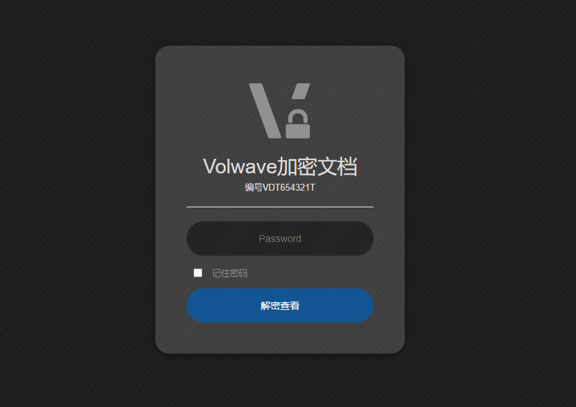

# Volwave staticrypt 加密模板



## 安装依赖

```shell
npm install -g staticrypt
```

## 加密

```shell
./scrypt.ps1 待加密目录 文档编号 密码
```

加密时会在目录下生成`.staticrypt.json`文件，记录了加密盐，使用了相同密码和加密盐的页面在保存密码后跳转时不用重复解密。

如果需要使用不同的加密盐，删除旧的JSON配置文件即可。
